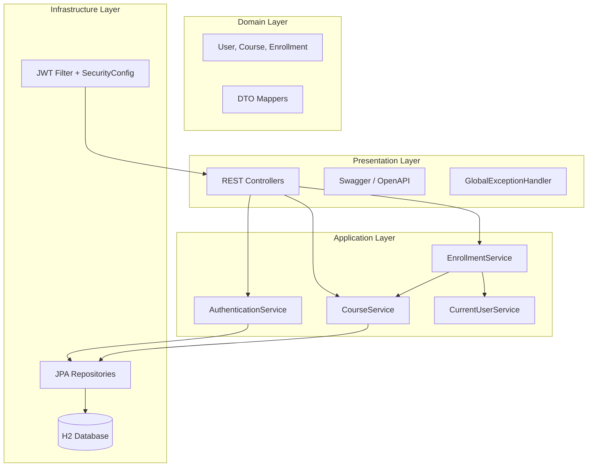
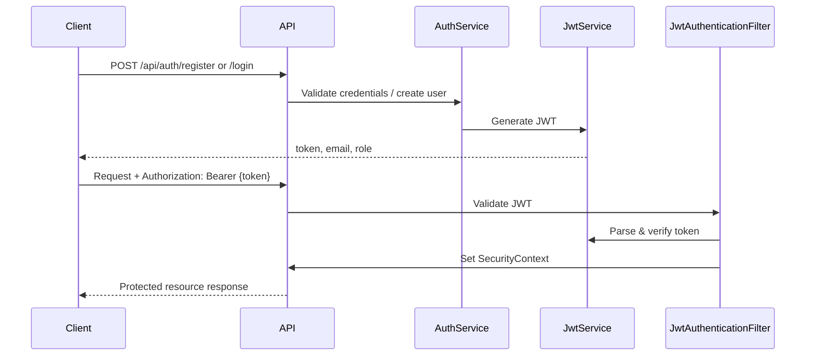

# Course Enrollment System

A REST API for managing university courses and student enrollments, built with **Spring Boot 3** and secured with **JWT authentication**. Students can browse courses, register, enroll, and drop classes; administrators can manage the course catalog.

---

## Features

- **User registration & login** with JWT access tokens (24-hour expiration)
- **Role-based access control** (`STUDENT`, `ADMIN`)
- **Public course catalog** with pagination and optional title search
- **Admin course management** (create, update, delete)
- **Student enrollments** (enroll, drop, list my courses)
- **Business rules**: duplicate enrollment prevention, course capacity limits, delete protection when enrollments exist
- **Request validation** on DTOs and entities
- **Centralized error handling** with consistent JSON error responses
- **OpenAPI / Swagger UI** for interactive API documentation
- **In-memory H2 database** with demo seed data on startup
- **JPA auditing** (`createdAt` on users, courses, enrollments)

---

## Technologies Used

| Category | Technology |
|----------|------------|
| Language | Java 17 |
| Framework | Spring Boot 3.4.5 |
| Security | Spring Security, JWT (JJWT 0.12.6) |
| Persistence | Spring Data JPA, Hibernate |
| Database | H2 (in-memory) |
| API Docs | SpringDoc OpenAPI 2.8.6 |
| Validation | Jakarta Bean Validation |
| Build | Maven |
| Utilities | Lombok |

---

## Architecture Overview

The application follows a **layered architecture** with clear separation of concerns:



| Layer | Responsibility |
|-------|----------------|
| **Controller** | HTTP mapping, validation triggers, response status codes |
| **Service** | Business logic, transactions, authorization context |
| **Repository** | Data access via Spring Data JPA |
| **Entity / DTO** | Persistence model vs API contract |
| **Security** | Authentication, JWT validation, route protection |
| **Exception** | Domain errors mapped to HTTP status codes |

---

## Prerequisites

- **Java 17** or later
- **Maven 3.9+** (or use the included Maven Wrapper)

Verify installations:

```bash
java -version
./mvnw -version
```

---

## Setup Instructions

1. **Clone the repository**

   ```bash
   git clone <repository-url>
   cd course-enrollment-system
   ```

2. **Build the project**

   ```bash
   ./mvnw clean install
   ```

   On Windows PowerShell:

   ```powershell
   .\mvnw.cmd clean install
   ```

3. **Configuration** (optional)

   Default settings are in `src/main/resources/application.properties`:

   | Property | Default |
   |----------|---------|
   | Server port | `8080` |
   | H2 JDBC URL | `jdbc:h2:mem:courseenrollmentdb` |
   | H2 username | `sa` |
   | H2 password | *(empty)* |
   | JWT expiration | `86400000` ms (24 hours) |

   For local overrides, use `application-local.properties` (gitignored).

---

## How to Run

**Start the application:**

```bash
./mvnw spring-boot:run
```

Windows:

```powershell
.\mvnw.cmd spring-boot:run
```

**Run tests:**

```bash
./mvnw test
```

The API is available at **http://localhost:8080** once you see `Started CourseEnrollmentSystemApplication` in the logs.

---

## Swagger UI

Interactive API documentation with JWT support:

| Resource | URL |
|----------|-----|
| **Swagger UI** | http://localhost:8080/swagger-ui.html |
| **OpenAPI JSON** | http://localhost:8080/v3/api-docs |

### Using JWT in Swagger

1. Call **POST** `/api/auth/login` or `/api/auth/register`.
2. Copy the `token` from the response.
3. Click **Authorize** in Swagger UI.
4. Enter: `Bearer <your-token>` (include the word `Bearer` and a space).
5. Execute protected endpoints.

---

## H2 Console

Inspect the in-memory database at runtime:

| Setting | Value |
|---------|-------|
| **URL** | http://localhost:8080/h2-console |
| **JDBC URL** | `jdbc:h2:mem:courseenrollmentdb` |
| **Username** | `sa` |
| **Password** | *(leave empty)* |

---

## Authentication Flow



1. **Register** (`POST /api/auth/register`) creates a `STUDENT` account and returns a JWT.
2. **Login** (`POST /api/auth/login`) authenticates with email/password and returns a JWT.
3. **Protected requests** send `Authorization: Bearer <token>`.
4. **JwtAuthenticationFilter** validates the token and loads the user into the security context.
5. **Role checks** in `SecurityConfig` enforce access (`ADMIN` for admin routes, `STUDENT` or `ADMIN` for enrollments).

---

## Sample Admin Credentials

Seeded automatically on first startup (`DataInitializer`):

| Field | Value |
|-------|-------|
| **Email** | `admin@course.edu` |
| **Password** | `admin123` |
| **Role** | `ADMIN` |

Five sample courses are also seeded when the database is empty.

**Students** must register via `POST /api/auth/register` before enrolling in courses.

---

## API Endpoints Summary

### Authentication (public)

| Method | Endpoint | Description | Success |
|--------|----------|-------------|---------|
| `POST` | `/api/auth/register` | Register a new student | `201` |
| `POST` | `/api/auth/login` | Login and receive JWT | `200` |

### Courses (public read)

| Method | Endpoint | Description | Success |
|--------|----------|-------------|---------|
| `GET` | `/api/courses?page=0&size=10` | List courses (paginated) | `200` |
| `GET` | `/api/courses?title=Spring&page=0&size=10` | Filter by title (partial match) | `200` |
| `GET` | `/api/courses/{id}` | Get course by ID | `200` |

### Admin — Courses (`ADMIN` + JWT)

| Method | Endpoint | Description | Success |
|--------|----------|-------------|---------|
| `POST` | `/api/admin/courses` | Create a course | `201` |
| `PUT` | `/api/admin/courses/{id}` | Update a course | `200` |
| `DELETE` | `/api/admin/courses/{id}` | Delete a course (no enrollments) | `204` |

### Enrollments (`STUDENT` or `ADMIN` + JWT)

| Method | Endpoint | Description | Success |
|--------|----------|-------------|---------|
| `POST` | `/api/enrollments/{courseId}` | Enroll in a course | `201` |
| `DELETE` | `/api/enrollments/{courseId}` | Drop a course | `204` |
| `GET` | `/api/enrollments/me` | List my enrollments | `200` |

### Common HTTP Status Codes

| Code | Meaning |
|------|---------|
| `400` | Validation error, bad request |
| `401` | Missing or invalid JWT |
| `403` | Insufficient permissions |
| `404` | Resource not found |
| `409` | Conflict (duplicate email, full course, etc.) |
| `500` | Unexpected server error |

### Error Response Format

```json
{
  "timestamp": "2026-05-20T12:00:00",
  "status": 404,
  "error": "Course not found with id: 99",
  "details": {
    "email": "Email must be valid"
  }
}
```

The `details` field appears only for validation errors.

---

## Project Structure

```
course-enrollment-system/
├── pom.xml
├── mvnw / mvnw.cmd
├── README.md
└── src/
    ├── main/
    │   ├── java/com/sumaya/course_enrollment_system/
    │   │   ├── CourseEnrollmentSystemApplication.java
    │   │   ├── api/                    # API path constants, pagination helpers
    │   │   │   ├── ApiPaths.java
    │   │   │   └── PageableSupport.java
    │   │   ├── config/                 # Security, OpenAPI, seed data
    │   │   │   ├── DataInitializer.java
    │   │   │   ├── OpenApiConfig.java
    │   │   │   ├── OpenApiExamples.java
    │   │   │   └── SecurityConfig.java
    │   │   ├── controller/             # REST endpoints
    │   │   │   ├── AdminCourseController.java
    │   │   │   ├── AuthController.java
    │   │   │   ├── CourseController.java
    │   │   │   └── EnrollmentController.java
    │   │   ├── dto/                    # Request/response models
    │   │   ├── entity/                 # JPA entities
    │   │   ├── exception/              # Custom exceptions & handler
    │   │   ├── mapper/                 # Entity ↔ DTO mapping
    │   │   ├── repository/             # Spring Data JPA
    │   │   ├── security/               # JWT filter & service
    │   │   ├── service/                # Business logic
    │   │   └── validation/           # Shared validation constants
    │   └── resources/
    │       └── application.properties
    └── test/
        └── java/.../CourseEnrollmentSystemApplicationTests.java
```

---

## License

This project is provided for educational and demonstration purposes.
